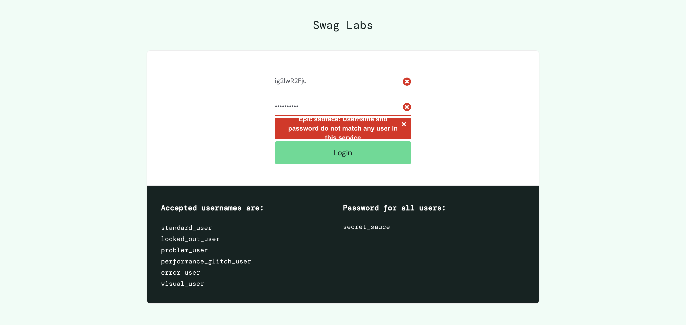

# Web automation using Selenium and Java with POM approach

This is a web automation project for the https://www.saucedemo.com 
using Selenium with Java.

The project follows a clean and maintainable POM architecture, considering that web
apps tend to grow over time.

## Dependencies

The following dependencies are used in this project:

- TestNG
- Selenium
- Lombok
- Hamcrest
- And more (see the full list in the `pom.xml` file).

## Screenshots on test failures
Whenever a test case fails, it takes screenshot for better bug inspection. Sample case below:

## Run tests
- Run tests > `mvn clean test`